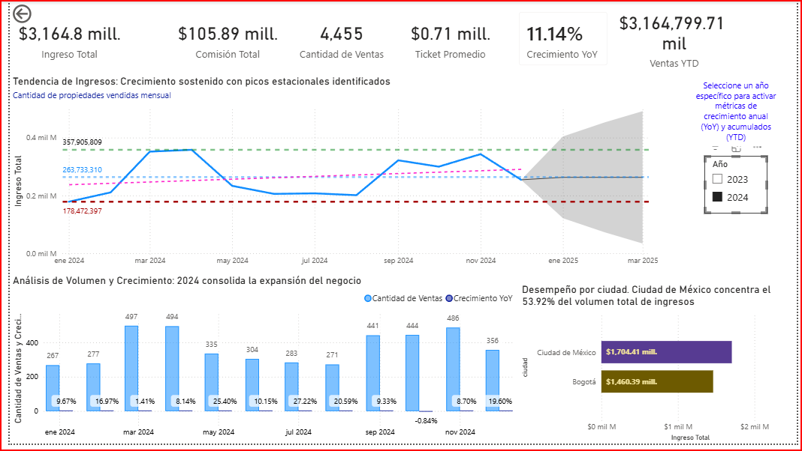
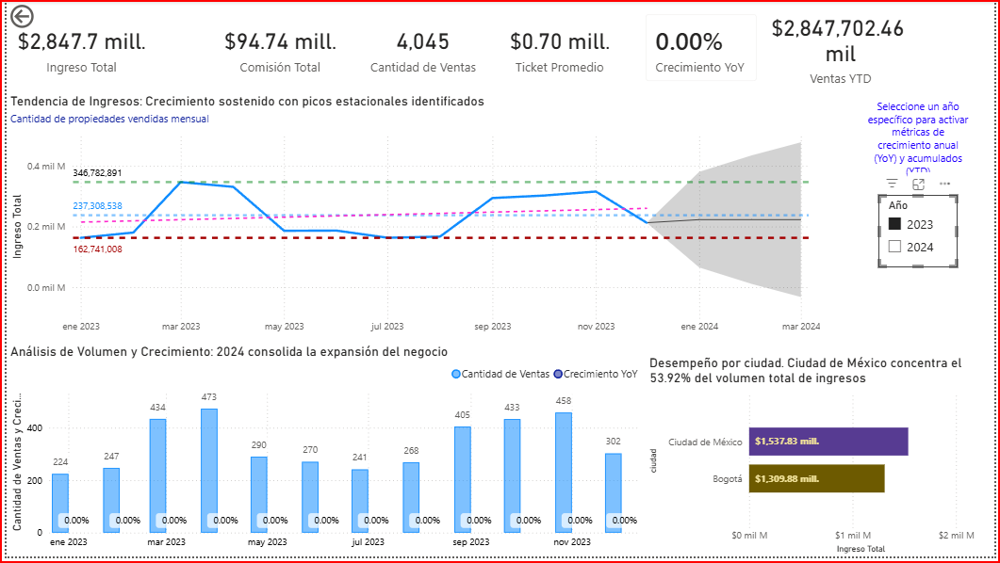
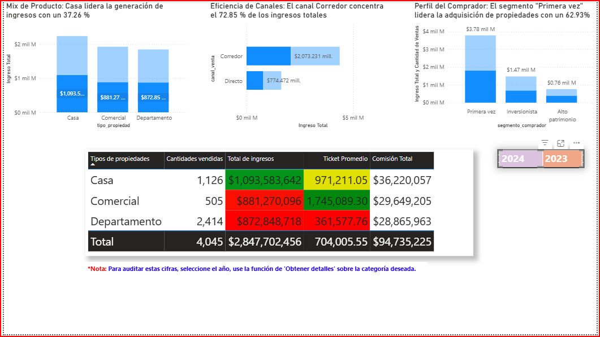
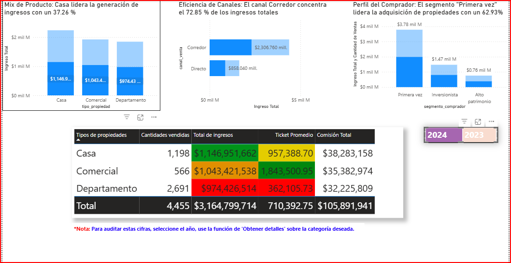

# 📊 Proyecto Analítico: Desempeño e Inteligencia Comercial Inmobiliaria — Grupo Andes

Este repositorio alberga la infraestructura analítica completa para el análisis comercial del **Grupo Andes** (Andes Capital Real Estate). El objetivo principal es responder de forma ágil a preguntas estratégicas de negocio asociadas a ingresos brutos, efectividad de canales, categorización de clientes e inteligencia de tiempo basada en cohortes transaccionales de recompra.

---

## 📂 Estructura del Proyecto

El repositorio está organizado bajo las mejores prácticas de gobernanza de Inteligencia de Negocios:

```text
├── data/
│   ├── hecho_ventas_propiedades.csv
│   ├── dim_clientes.csv
│   └── dim_propiedades.csv
├── pbix/
│   └── Proyecto_10_Estrategia_comercial_de_Andes_Capital_Real_Estate.pbix
├── notebooks/
│   └── S11_Estudiante_Proyecto_InmobiliarioGrupoAndes.ipynb
├── docs/
│   └── images/
│       ├── CH1.png
│       ├── CH 2.png
│       ├── FinalH1_A.png
│       ├── FinalH1_B.png
│       ├── FinalH1_C.png
│       ├── FinalH2_A.png
│       ├── FinalH2_B.png
│       └── FinalH2_C.png
└── src/
    └── dax/
        ├── calculated_objects/
        │   ├── dim_fecha_table.dax
        │   └── hecho_ventas_columns.dax
        ├── ingresos_base_measures.dax
        └── contexto_filtro_measures.dax
```

---

## 📌 1. Arquitectura del Modelo de Datos (Esquema en Estrella)

El ecosistema de datos de Power BI se modela bajo relaciones unidireccionales directas (1:*), con filtros simples activos:

* **`hecho_ventas_propiedades` (Central):** Matriz transaccional de cierres comerciales. Contiene métricas de precio, comisión y referencias cruzadas.
* **`dim_clientes`:** Segmentación cualitativa de compradores (Inversionistas, Alto Patrimonio, Primera Vez).
* **`dim_propiedades`:** Desglose físico, tipología e indexación geográfica de bienes raíces.
* **`dim_fecha`:** Dimensión de tiempo autocontenida y dinámica.

### Relaciones del Modelo
* `dim_clientes[id_cliente]` 1 ─── * `hecho_ventas_propiedades[id_cliente]`
* `dim_propiedades[id_propiedad]` 1 ─── * `hecho_ventas_propiedades[id_propiedad]`
* `dim_fecha[Date]` 1 ─── * `hecho_ventas_propiedades[fecha_venta]`

---

## 🛠️ 2. Gobernanza del Código DAX

La lógica analítica prescinde de transformaciones complejas en Power Query para priorizar el rendimiento, centralizando el cálculo en expresiones estructuradas DAX:

### 2.1 Métricas Base (ver [ingresos_base_measures.dax](file:///d:/Anty_Gravity_Proyectos/SNIPER_CORE/Proyectos_GitHub/Proyecto_10_Estrategia_comercial_de_Andes_Capital_Real_Estate/src/dax/ingresos_base_measures.dax))
* **Ingreso Total:** Sumatoria explícita del precio de venta.
* **Cantidad de Ventas:** Total de transacciones cerradas.
* **Ticket Promedio:** Relación de ingresos sobre volumen de ventas.
* **Comisión Total:** Ingresos generados para la empresa basados en la comisión pactada.

### 2.2 Modificación de Contexto de Filtro (ver [contexto_filtro_measures.dax](file:///d:/Anty_Gravity_Proyectos/SNIPER_CORE/Proyectos_GitHub/Proyecto_10_Estrategia_comercial_de_Andes_Capital_Real_Estate/src/dax/contexto_filtro_measures.dax))
* **% Participación por Tipo de Propiedad, Canal de Venta y Segmento:** Cálculos dinámicos que recalculan porcentajes sobre el total nacional removiendo filtros cruzados específicos utilizando `CALCULATE` y `REMOVEFILTERS`.
* **% de Retención (Cohortes):** Compara el ingreso de transacciones recurrentes contra el mes de adquisición (Mes 0) para evaluar la retención neta del cliente.

### 2.3 Objetos Calculados (ver [calculated_objects/](file:///d:/Anty_Gravity_Proyectos/SNIPER_CORE/Proyectos_GitHub/Proyecto_10_Estrategia_comercial_de_Andes_Capital_Real_Estate/src/dax/calculated_objects/))
* **`dim_fecha`:** Tabla de tiempo construida dinámicamente según la ventana operativa del negocio.
* **Columnas de Cohorte:** Determinan la primera fecha de compra del usuario (`Primera compra por cliente`), el inicio de mes de la adquisición (`Mes Cohorte`), y la distancia en meses respecto al evento transaccional actual (`Meses Desde Primera Compra`).

---

## 📈 3. Reportes y Dashboards

### 3.1 Overview Ejecutivo (Página 1)
Presenta un balance de alto nivel con los KPIs financieros y geográficos.



### 3.2 Análisis Comercial (Página 2)
Análisis pormenorizado del rendimiento por tipo de propiedad, segmentos de clientes y formatos de comercialización.



### 3.3 Matriz de Cohortes (Página 3)
Evaluación del ciclo de vida del cliente y patrones transaccionales repetitivos en tiempo relativo.


---

## 📝 4. Resumen Ejecutivo & Decisiones de Negocio

### 🎯 Hallazgos Clave
* **Ingreso del Periodo:** **$6,012.50 millones** generados mediante **8,500 propiedades** vendidas.
* **Ticket Promedio:** **$707,353.20** por transacción.
* **Comisión Total Recaudada:** **$200.63 millones** de ganancia neta corporativa.
* **Líder de Producto:** Las propiedades de tipo **Casa** dominan el revenue aportando el **37.26%** ($2,240.50 M).
* **Líder de Ventas:** La **Ciudad de México** representa el **53.92%** de los ingresos totales ($3,242.23 M) superando a Bogotá.
* **Eficiencia de Canales:** El canal de **Corredores** concentra el **72.85%** de la facturación total ($4,379.99 M).

### 💡 Insights Accionables
1. **Perfil de Adquisición:** El segmento de clientes **Primera vez** lidera los ingresos con el **62.93%** ($3.78 mil millones), demostrando que la adquisición de clientes es el principal motor del negocio actual.
2. **Crecimiento Sólido:** Se registra un incremento del **11.14% YoY** en ingresos al cierre del periodo actual comparado con el anterior.
3. **Comportamiento del Cliente (Cohortes):** Los clientes de la cohorte de **Marzo 2023** demostraron una retención y recurrencia histórica excepcional, manteniendo ingresos constantes por recompras durante 19 meses consecutivos.

### 🚀 Recomendaciones Estratégicas
* **Estrategia Comercial Dual:** Mantener el volumen de ventas en propiedades tipo **Casa** (37.26% participación) mientras se promueve la comercialización de propiedades de tipo **Comercial**, las cuales registran el mayor ticket promedio unitario ($1.84 M).
* **Consolidar Red de Corredores:** Dado que el **72.85%** de los ingresos provienen de corredores externos, es crucial destinar presupuestos para programas de lealtad, comisiones competitivas y capacitación continua para este canal.
* **Plan de Retención 2026:** Implementar planes de post-venta y campañas específicas para mejorar la recompra en cohortes de usuarios recientes, ya que sus ingresos iniciales son menores en un 50% comparados con los registros fuertes de 2023.

---

## ⚙️ 5. Inicialización de Despliegue en Consola de Comandos (Git)

Una vez estructurado el proyecto, inicialice y publique los cambios en Git:

```bash
git init
git add .
git commit -m "feat: infrastructure deployment, core DAX architecture, and documentation assets"
git branch -M main
```
