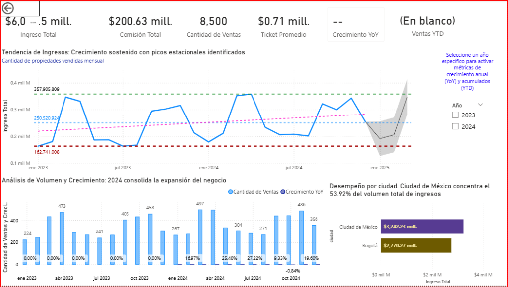
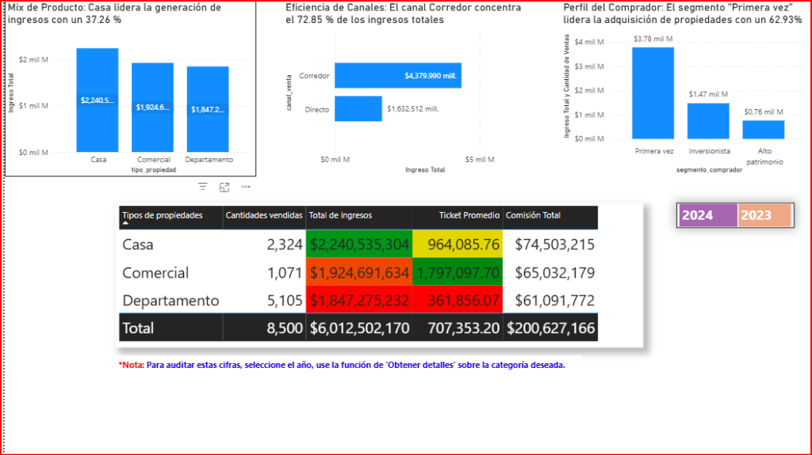
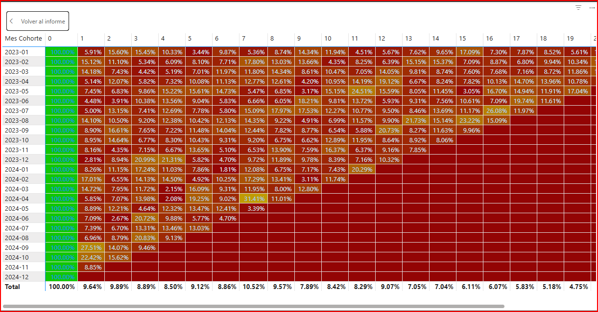

# 📊 Proyecto Analítico: Desempeño e Inteligencia Comercial Inmobiliaria — Grupo Andes

Este repositorio alberga la infraestructura analítica completa para el análisis comercial del **Grupo Andes** (Andes Capital Real Estate). El objetivo principal es responder de forma ágil a preguntas estratégicas de negocio asociadas a ingresos brutos, efectividad de canales, categorización de clientes e inteligencia de tiempo basada en cohortes transaccionales de recompra.

---

## 📂 Estructura del Proyecto

El repositorio está organizado bajo las mejores prácticas de gobernanza de Inteligencia de Negocios:

```text
├── data/
│   ├── hecho_ventas_propiedades.csv
│   ├── dim_clientes.csv
│   └── dim_propiedades.csv
├── pbix/
│   └── Proyecto_10_Estrategia_comercial_de_Andes_Capital_Real_Estate.pbix
├── notebooks/
│   └── S11_Estudiante_Proyecto_InmobiliarioGrupoAndes.ipynb
├── docs/
│   └── images/
│       ├── CH1.png
│       ├── CH 2.png
│       ├── Comercial_Dashboard_Unfiltered.png
│       ├── Overview_Dashboard_Unfiltered.png
│       ├── FinalH1_A.png
│       ├── FinalH1_B.png
│       ├── FinalH1_C.png
│       ├── FinalH2_A.png
│       ├── FinalH2_B.png
│       └── FinalH2_C.png
└── src/
    └── dax/
        ├── calculated_objects/
        │   ├── dim_fecha_table.dax
        │   └── hecho_ventas_columns.dax
        ├── ingresos_base_measures.dax
        └── contexto_filtro_measures.dax
```

---

## 📌 1. Arquitectura del Modelo de Datos (Esquema en Estrella)

El ecosistema de datos de Power BI se modela bajo relaciones unidireccionales directas (1:*), con filtros simples activos:

* **`hecho_ventas_propiedades` (Central):** Matriz transaccional de cierres comerciales. Contiene métricas de precio, comisión y referencias cruzadas.
* **`dim_clientes`:** Segmentación cualitativa de compradores (Inversionistas, Alto Patrimonio, Primera Vez).
* **`dim_propiedades`:** Desglose físico, tipología e indexación geográfica de bienes raíces.
* **`dim_fecha`:** Dimensión de tiempo autocontenida y dinámica.

### Relaciones del Modelo
* `dim_clientes[id_cliente]` 1 ─── * `hecho_ventas_propiedades[id_cliente]`
* `dim_propiedades[id_propiedad]` 1 ─── * `hecho_ventas_propiedades[id_propiedad]`
* `dim_fecha[Date]` 1 ─── * `hecho_ventas_propiedades[fecha_venta]`

---

## 🛠️ 2. Gobernanza del Código DAX

La lógica analítica prescinde de transformaciones complejas en Power Query para priorizar el rendimiento, centralizando el cálculo en expresiones estructuradas DAX:

### 2.1 Métricas Base (ver [ingresos_base_measures.dax](file:///d:/Anty_Gravity_Proyectos/SNIPER_CORE/Proyectos_GitHub/Proyecto_10_Estrategia_comercial_de_Andes_Capital_Real_Estate/src/dax/ingresos_base_measures.dax))
* **Ingreso Total:** Sumatoria explícita del precio de venta (`SUM('hecho_ventas_propiedades'[precio_venta])`).
* **Cantidad de Ventas:** Total de transacciones cerradas.
* **Ticket Promedio:** Relación de ingresos sobre volumen de ventas.
* **Comisión Total:** Ingresos generados para la empresa basados en la comisión pactada.

### 2.2 Modificación de Contexto de Filtro (ver [contexto_filtro_measures.dax](file:///d:/Anty_Gravity_Proyectos/SNIPER_CORE/Proyectos_GitHub/Proyecto_10_Estrategia_comercial_de_Andes_Capital_Real_Estate/src/dax/contexto_filtro_measures.dax))
* **% Participación por Tipo de Propiedad, Canal de Venta y Segmento:** Cálculos dinámicos que recalculan porcentajes sobre el total nacional removiendo filtros cruzados específicos utilizando `CALCULATE` y `REMOVEFILTERS`.
* **% de Retención (Cohortes):** Compara el ingreso de transacciones recurrentes contra el mes de adquisición (Mes 0) para evaluar la retención neta del cliente.

### 2.3 Objetos Calculados (ver [calculated_objects/](file:///d:/Anty_Gravity_Proyectos/SNIPER_CORE/Proyectos_GitHub/Proyecto_10_Estrategia_comercial_de_Andes_Capital_Real_Estate/src/dax/calculated_objects/))
* **`dim_fecha`:** Tabla de tiempo construida dinámicamente según la ventana operativa del negocio.
* **Columnas de Cohorte:** Determinan la primera fecha de compra del usuario (`Primera compra por cliente`), el inicio de mes de la adquisición (`Mes Cohorte`), y la distancia en meses respecto al evento transaccional actual (`Meses Desde Primera Compra`).

---

## 📈 3. Reportes y Dashboards (Contexto General y Previsión)

Las capturas de los tableros analíticos muestran el **estado general consolidado (sin filtros de año activos)**:

### 3.1 Overview Ejecutivo (Página 1)
Presenta un balance de alto nivel con los KPIs financieros y geográficos en una vista general acumulada.


> [!NOTE]
> **Contexto de Filtros Temporal:** Como se muestra en la captura superior, los campos de **Crecimiento YoY** y **Ventas YTD** se encuentran vacíos (`--` / `(En blanco)`). Esto ocurre intencionalmente porque las visualizaciones representan el consolidado total histórico sin ningún año seleccionado en el segmentador lateral. Para que el motor DAX calcule correctamente el crecimiento acumulado anual y la comparativa interanual, el usuario final debe seleccionar un año específico (por ejemplo, el año más reciente: `2024`).

#### 🔮 Análisis de Previsión a 3 Meses (Forecasting)
En el gráfico de líneas de **Tendencia de Ingresos**, se ha configurado un modelo de previsión estadística para los siguientes 3 meses (proyectado hasta enero de 2025):
* **Límites de la Previsión:** 
  * **Valor Mínimo Esperado:** **$162,741,008** (indicado por la línea discontinua roja inferior).
  * **Valor Máximo Esperado:** **$357,905,809** (indicado por la línea discontinua verde superior).
  * **Valor Promedio Esperado:** **$250,520,924** (indicado por la línea punteada azul central).
* **Interpretación:** La sombra gris al final de la serie de tiempo (hacia enero de 2025) representa el intervalo de confianza de la previsión. La línea de tendencia general (rosa discontinua) apunta a un crecimiento sostenido a largo plazo con picos estacionales recurrentes bien definidos a mitad y final de cada año fiscal.

---

### 3.2 Análisis Comercial (Página 2)
Análisis de la distribución de ingresos según propiedades, canales de venta y segmentos de compradores en su estado consolidado sin filtrar año.


* **Mix de Productos:** El gráfico de barras ratifica que **Casa** es la categoría dominante aportando el **37.26%** ($2,240.5M), seguida de **Comercial** ($1,924.6M) y **Departamento** ($1,847.2M).
* **Gobernanza Visual en Tabla:** La matriz comercial utiliza formatos condicionales tipo semáforo para clasificar el rendimiento:
  * **Verde (Desempeño Alto):** Casa en Ingresos ($2.24B) y Comercial en Ticket Promedio ($1.79M).
  * **Amarillo (Desempeño Medio):** Casa en Ticket Promedio ($964K).
  * **Rojo (Desempeño Bajo):** Comercial y Departamento en Ingresos, y Departamento en Ticket Promedio ($361K).

---

### 3.3 Matriz de Cohortes (Página 3)
Evaluación del ciclo de vida del cliente y patrones transaccionales repetitivos en tiempo relativo.


---

## 📝 4. Resumen Ejecutivo & Insights de Negocio

A partir de los tableros analíticos diseñados, se extraen las siguientes métricas y comportamientos comerciales:

### 🎯 Métricas Principales (Consolidado Histórico)
* **Ingreso Total del Negocio:** **$6,012,502,170** (seis mil doce millones de pesos).
* **Volumen Operativo:** **8,500 propiedades** comercializadas.
* **Ticket Promedio Global:** **$707,353.20** por transacción.
* **Margen Neto (Comisión Total):** **$200,627,166** acumulados.

### 💡 Hallazgos Comerciales y de Clientes
* **Perfil de Adquisición:** El segmento de clientes **"Primera vez"** es el pilar de ingresos del negocio con **$3.78 mil millones (62.93%)**, superando ampliamente a los **Inversionistas ($1.47 mil millones)** y a los clientes de **Alto Patrimonio ($0.76 mil millones)**.
* **Canales de Venta:** Alta dependencia de intermediarios; el canal **Corredor** aporta el **72.85% ($4,379.99 millones)** frente al canal **Directo ($1,632.51 millones)**.
* **Distribución Territorial:** La **Ciudad de México** concentra el **53.92% ($3,242.23 millones)** de la facturación, mientras que **Bogotá** representa el restante **$2,770.27 millones**.

---

## 🔍 5. Áreas de Oportunidad y Sugerencias de Mejora

### 🛠️ 5.1 Oportunidades Técnicas (Visuales y de Modelo)
* **Ajuste de Visualización en Tarjetas de KPI (Truncamiento):** La tarjeta de "Ingreso Total" en el Overview Ejecutivo presenta truncamiento visual en el valor (`$6,0...5 mill.`). Se sugiere aumentar el ancho del contenedor visual, disminuir el tamaño de la fuente a 35pt, o modificar el formato de visualización a millones (`$6,012.5 M`) para garantizar una lectura limpia.
* **Gobernanza Monetaria y Tipo de Cambio:** El dashboard consolida y compara directamente facturaciones de **Ciudad de México** (MXN) y **Bogotá** (COP) bajo una misma escala numérica sin una tasa de conversión explícita. Esto distorsiona la comparación real de valor financiero. Se debe integrar una tabla de tipos de cambio históricos en el modelo estrella para normalizar la moneda (ej. a USD) o implementar un selector dinámico de divisa.

### 💼 5.2 Oportunidades de Estrategia de Negocio
* **Eficiencia Operativa en Departamentos:** El segmento de Departamentos consume el **60% del volumen operativo (5,105 transacciones)** pero aporta únicamente el **30% de los ingresos** debido a su bajo ticket promedio. Se sugiere optimizar los procesos de originación y cierre digital para este segmento para reducir costos operativos transaccionales.
* **Desarrollo de Canal Directo:** El negocio paga altas comisiones externas dado que el 72.85% de las ventas ocurren vía Corredores. Incentivar la venta directa mediante marketing digital propio y plataformas exclusivas de Andes Capital aumentará la rentabilidad neta.
* **Fidelización y Recompra de Clientes:** Dado que los clientes de "Primera Vez" representan el 62.93% de las ventas y las cohortes recientes muestran una retención menor, se requiere implementar un plan de CRM dirigido a la conversión de compradores primerizos en Inversionistas recurrentes mediante ofertas de portafolios comerciales.

---

## ⚙️ 6. Inicialización de Despliegue en Consola de Comandos (Git)

Una vez estructurado el proyecto, inicialice y publique los cambios en Git:

```bash
git init
git add .
git commit -m "feat: updated images context, unfiltered metrics status, and 3-month forecasting analysis"
git branch -M main
git push -u origin main
```
